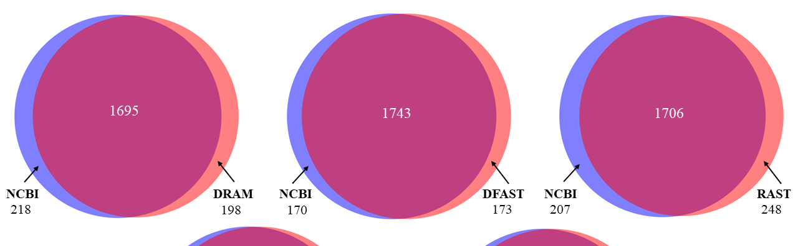
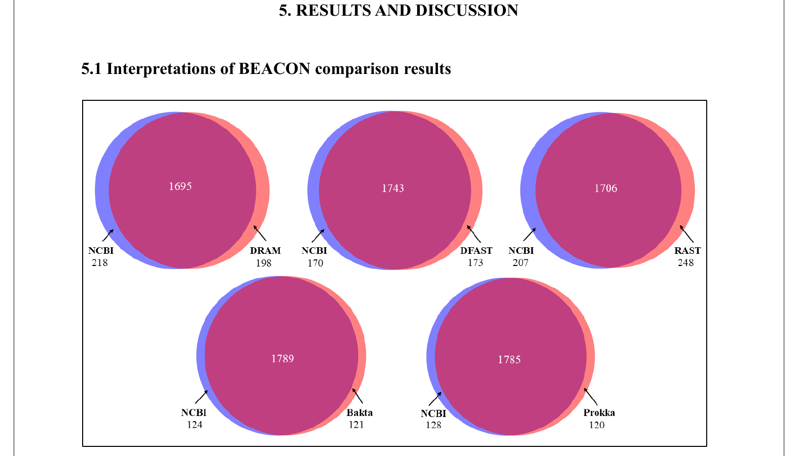
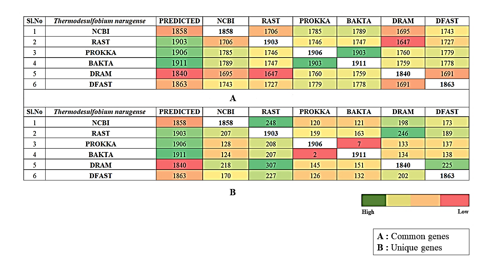
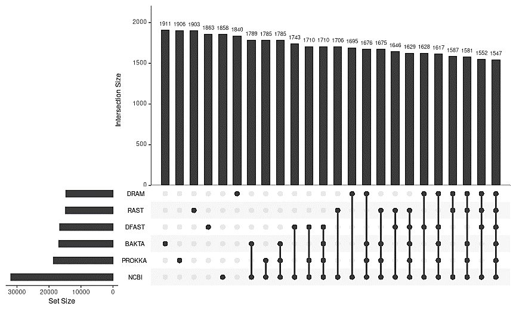
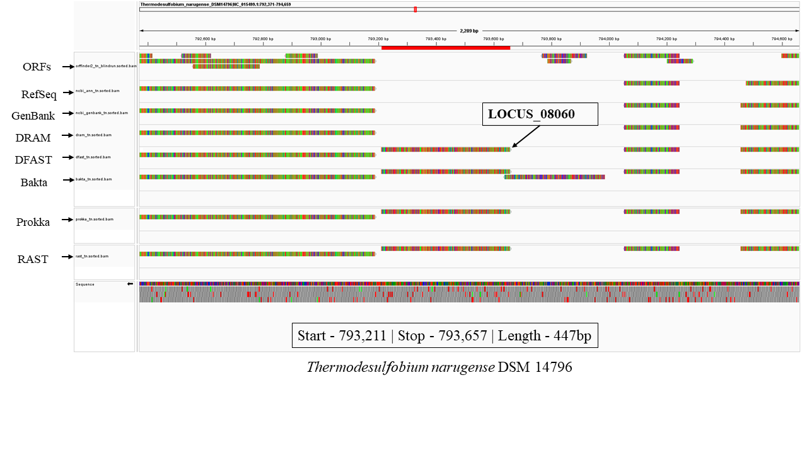
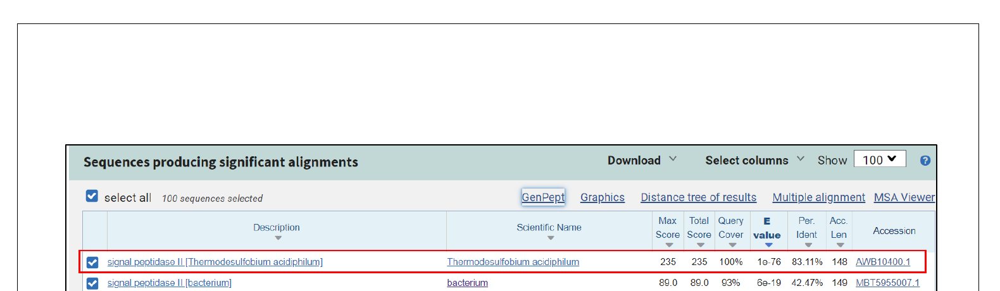
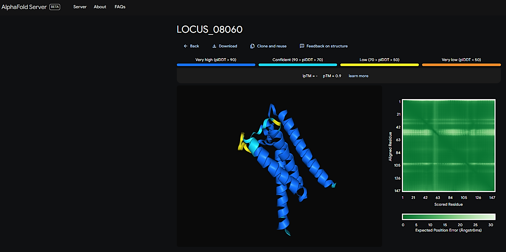
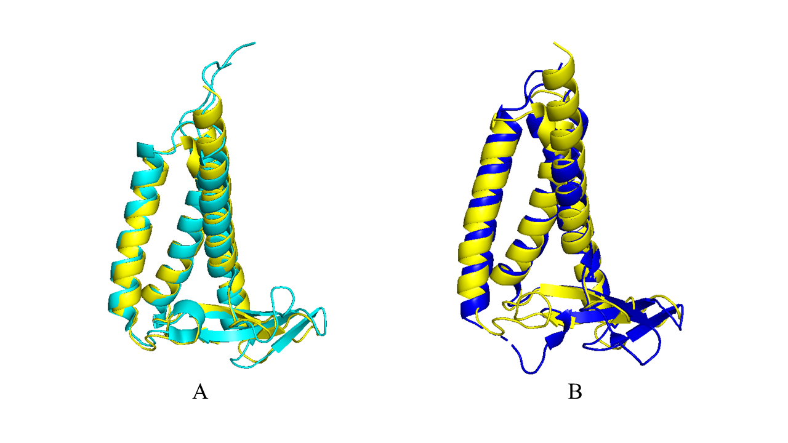
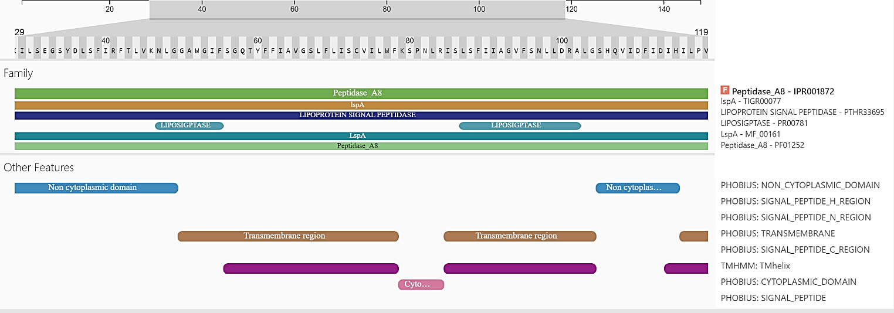
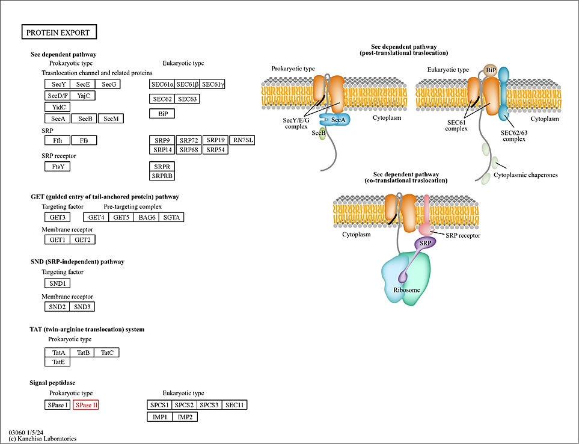

<div align="center">

<table border="0" cellspacing="0" cellpadding="0">
<tr>
<td align="center" width="160">
<a href="https://www.imtech.res.in">

</a>
</td>
<td align="center" width="500">

# 🧬 Bacterial Genome Annotation Benchmark
### *A Case Study Using the Genome of* Thermodesulfobium narugense

</td>
<td align="center" width="160">
<a href="https://www.alagappauniversity.ac.in">

</a>
</td>
</tr>
</table>

**Comparative evaluation of DRAM · DFAST · Prokka · Bakta · RAST vs. NCBI-PGAP  
with AlphaFold3-assisted novel gene discovery**

<br>

[](https://www.imtech.res.in)
[](https://www.imtech.res.in/skill-development)
[](https://www.alagappauniversity.ac.in)
[](LICENSE)

<br>

[](https://www.ncbi.nlm.nih.gov/datasets/genome/GCF_000212395.1/)
[](https://www.ncbi.nlm.nih.gov/datasets/genome/GCF_000212395.1/)
[]()
[]()
[]()
[](https://alphafoldserver.com)

</div>
<br>



---

> **Author:** Vaishnav P Varma · Dept. of Bioinformatics, Alagappa University, Karaikudi
> **Supervisor:** [Dr. Srikrishna Subramanian](https://www.imtech.res.in/contact/staff/dr-srikrishna-subramanian/113), Chief Scientist, CSIR-IMTECH
> **Duration:** May 15 – July 14, 2024 · CSIR-Institute of Microbial Technology, Chandigarh

---

## 📋 Table of Contents

| # | Section |
|---|---|
| 1 | [Abstract](#-abstract) |
| 2 | [Key Finding](#-key-finding) |
| 3 | [Background](#-background) |
| 4 | [Organism & Dataset](#-organism--dataset) |
| 5 | [Tools & Methods](#️-tools--methods) |
| 6 | [Results & Figures](#-results--figures) |
| 7 | [Conclusion](#-conclusion) |
| 8 | [Quick Links — All Tools & Databases](#-quick-links--all-tools--databases) |
| 9 | [References](#-references) |
| 10 | [Contact](#-contact) |
| 11 | [Appendix](#-appendix) |

---

## 📄 Abstract

Accurate genome annotation remains a cornerstone challenge in microbial genomics. This project benchmarks **five widely used bacterial genome annotation pipelines** — DRAM, DFAST, Prokka, Bakta, and RAST — against the gold-standard **NCBI RefSeq / PGAP** annotation of *Thermodesulfobium narugense* DSM 14796, a thermophilic sulfate-reducing bacterium with a compact ~1.9 Mbp genome and low GC content (~34%).

Using [BEACON](https://doi.org/10.1186/s12864-015-1826-4) for pairwise annotation comparison, [DIAMOND BLASTp](https://doi.org/10.1038/s41592-021-01101-x) for sequence-level filtering, and [IGV](https://doi.org/10.1038/nbt.1754) for visual genome inspection, the study identifies **one genuine protein-coding gene missed by NCBI-PGAP**: `LOCUS_08060`. This gene is subsequently validated and characterised as **Lipoprotein Signal Peptidase II (LspA)** — an essential enzyme in bacterial protein export — via homology search, [AlphaFold3](https://doi.org/10.1038/s41586-024-07487-w) structure prediction, [DALI](https://doi.org/10.1093/nar/gkac387) structural search, [InterProScan](https://doi.org/10.1093/nar/gki442) domain analysis, and [KAAS](https://doi.org/10.1093/nar/gkm321) pathway mapping.

> **Keywords:** bacterial genome annotation · gene prediction benchmark · *Thermodesulfobium narugense* · NCBI-PGAP · DRAM · DFAST · Prokka · Bakta · RAST · AlphaFold3 · signal peptidase II · lipoprotein · comparative genomics · BEACON · microbial bioinformatics · CSIR-IMTECH · PGTP

---

## 🔬 Key Finding

<div align="center">

```
┌─────────────────────────────────────────────────────────────┐
│                    🏆  LOCUS_08060                          │
│                                                             │
│  Location  :  793,211 – 793,657  (T. narugense chromosome) │
│  Length    :  447 bp                                        │
│  Predicted by: RAST · Prokka · Bakta                        │
│  Missed by :  NCBI-PGAP · DRAM                              │
│  Identity  :  83.11% to T. acidophilum homolog              │
│  Function  :  Lipoprotein Signal Peptidase II (LspA)        │
│  AlphaFold3 pTM Score :  0.9  (High confidence)            │
│  DALI top hit: 6ryp (Z=19.6, RMSD=1.6 Å) · S. aureus      │
└─────────────────────────────────────────────────────────────┘
```

</div>

---

## 📚 Background

### Types of Genome Annotation

Bacterial genome annotation proceeds in two stages:

**Structural annotation** locates the physical features of the genome — ORFs, CDS, tRNAs, rRNAs, ncRNAs, CRISPR arrays, promoters, RBS, IS elements, and transposons.

**Functional annotation** assigns biological meaning via GO terms, KEGG pathway mapping, Pfam/InterPro domain identification, and BLAST homology search.

| Approach | Description | Strength | Limitation |
|---|---|---|---|
| **Ab initio** | HMMs / neural networks on raw DNA | Can find novel genes | Sensitive to training data |
| **Homology-based** | Align against known sequences | High accuracy for known genes | Misses novel/divergent features |
| **Integrative** | Combines both approaches | Best accuracy + coverage | Computationally intensive |

[NCBI-PGAP](https://www.ncbi.nlm.nih.gov/genome/annotation_prok/) exemplifies the integrative approach and is the benchmark standard for prokaryotic annotation.

### Databases Used by Each Tool

| Tool | Core Databases |
|---|---|
| [**NCBI-PGAP**](https://www.ncbi.nlm.nih.gov/genome/annotation_prok/) | RefSeq · UniProt · COG · Pfam · TIGRFAM · InterPro · KEGG · SEED · GO · Rfam |
| [**DRAM**](https://github.com/WrightonLabCSU/DRAM) | KEGG · UniRef90 · Pfam · dbCAN · RefSeq viral · VOGDB · MEROPS |
| [**DFAST**](https://dfast.ddbj.nig.ac.jp/) | Custom curated database |
| [**RAST**](https://rast.nmpdr.org/) | SEED · GREENGENES · RDP-II · SILVA · European rRNA DB |
| [**Prokka**](https://github.com/tseemann/prokka) | ISFinder · UniProt · NCBI AMR Reference Gene DB |
| [**Bakta**](https://github.com/oschwengers/bakta) | Rfam · Mob-suite · DoriC · AntiFam · UniProt · RefSeq · COG · KEGG · PHROG · AMRFinder · ISFinder · Pfam · VFDB |

### Software Integrations by Tool

| Tool | Key Software Components |
|---|---|
| [NCBI-PGAP](https://www.ncbi.nlm.nih.gov/genome/annotation_prok/) | GeneMarkS2+ · tRNAscan-SE · ORFfinder · HMMER · Infernal · CRT · PILER-CR · AntiFam · CheckM |
| [DRAM](https://github.com/WrightonLabCSU/DRAM) | Prodigal · tRNAscan-SE · barrnap · GTDB-Tk · CheckM · VirSorter |
| [DFAST](https://dfast.ddbj.nig.ac.jp/) | MetaGeneAnnotator · Aragorn · barrnap · CRT · GHOSTX/Z · NCBI BLAST+ · HMMER |
| [RAST](https://rast.nmpdr.org/) | GLIMMER · tRNAscan-SE · KAAS |
| [Prokka](https://github.com/tseemann/prokka) | Prodigal · RNAmmer · Aragorn · SignalP · Infernal |
| [Bakta](https://github.com/oschwengers/bakta) | Prodigal · tRNAscan-SE · PILER-CR · HMMER · Aragorn |

---

## 🦠 Organism & Dataset

### *Thermodesulfobium narugense* DSM 14796

*T. narugense* is a thermophilic, strictly anaerobic, sulfate-reducing bacterium first isolated from Narugo hot spring, Japan. It belongs to the class Thermodesulfobia and represents a deeply branching lineage within the bacterial domain.

| Property | Value |
|---|---|
| **Organism** | *Thermodesulfobium narugense* DSM 14796 |
| **RefSeq ID** | [GCF_000212395.1](https://www.ncbi.nlm.nih.gov/datasets/genome/GCF_000212395.1/) |
| **Assembly ID** | [ASM21239v1](https://www.ncbi.nlm.nih.gov/assembly/GCF_000212395.1) |
| **Genome Size** | ~1.9 Mbp |
| **CDS (NCBI-PGAP)** | 1,858 |
| **GC Content** | ~34% |
| **Genome Status** | Complete |
| **NCBI Taxonomy** | [Thermodesulfobium narugense](https://www.ncbi.nlm.nih.gov/Taxonomy/Browser/wwwtax.cgi?id=318076) |

**Why *T. narugense*?**
- Complete genome sequence available — essential for accurate annotation benchmarking
- Low GC content (~34%) provides informative contrast to GC-rich model organisms
- Less-studied species — high potential for novel gene discovery
- Compact genome — computationally tractable for multi-tool comparison

### Files Downloaded from [NCBI RefSeq](https://www.ncbi.nlm.nih.gov/refseq/)

| Format | Extension | Purpose |
|---|---|---|
| Complete genome | `.fasta` | Input for all annotation tools |
| General feature format | `.gff` | Reference annotation coordinates |
| Annotated CDS sequences | `.fna` | PGAP gold-standard reference |
| GenBank format | `.gb` | Required by BEACON for comparison |

---

## 🛠️ Tools & Methods

### Annotation Tools Used

| # | Tool | Version | Mode | Link |
|---|---|---|---|---|
| 1 | DRAM | v1.4 | Stand-alone | [GitHub](https://github.com/WrightonLabCSU/DRAM) |
| 2 | DFAST | v1.6.0 | Web server | [dfast.ddbj.nig.ac.jp](https://dfast.ddbj.nig.ac.jp/) |
| 3 | Prokka | v1.14.6 | Stand-alone | [GitHub](https://github.com/tseemann/prokka) |
| 4 | Bakta | v1.3.3 · DB v3.1 | Stand-alone | [GitHub](https://github.com/oschwengers/bakta) |
| 5 | RAST | '05/2024' | Web server | [rast.nmpdr.org](https://rast.nmpdr.org/) |

All tools were run with **default settings** to ensure a fair, unbiased comparison.

### Comparison & Validation Pipeline

```
 Genome FASTA (T. narugense DSM 14796 · GCF_000212395.1)
          │
          ├──► DRAM  ─────────────────────────────────────┐
          ├──► DFAST ───────────────────────────────────── │
          ├──► Prokka ──────────────────────────────────── │
          ├──► Bakta ───────────────────────────────────── │
          └──► RAST  ───────────────────────────────────── │
                                                           │
                    ┌──────────────────────────────────────┘
                    │    All 6 annotations (incl. NCBI-PGAP)
                    ▼
             BEACON comparison
             (pairwise, offset = 2%)
                    │
          ┌─────────┼──────────────────┐
          │         │                  │
       identical  similar           unique / unique-with-overlap
                                        │
                               DIAMOND BLASTp (v2.0.9)
                               e-value < 1e-5 · identity < 90% kept
                                        │
                               IGV v2.17.4 visual inspection
                               (full genome review)
                                        │
                               ► LOCUS_08060 identified
                                        │
              ┌─────────────────────────┼──────────────────────┐
              │                         │                      │
        NCBI BLASTp              AlphaFold3             PSAURON score
        (homology search)       (3D structure)         (bona fide check)
                                         │
                         ┌───────────────┴───────────────┐
                    DALI server                    InterProScan
                  (structural DB search)          (domain analysis)
                                                       │
                                               KAAS pathway mapping
                                               (KEGG Protein Export)
```

### BEACON Comparison Settings

[BEACON](https://doi.org/10.1186/s12864-015-1826-4) defines two genes as significantly overlapping if the start/stop deviation of the shorter gene vs. the longer is within **2%** of the shorter gene's length. Default offset used throughout.

### AlphaFold3 Confidence Scoring

| Score | Scale | Threshold | Interpretation |
|---|---|---|---|
| **pLDDT** | 0–100 | >90 very high · 70–90 high · 50–70 moderate | Per-residue confidence |
| **pTM** | 0–1 | >0.5 good | Overall fold confidence |
| **ipTM** | 0–1 | >0.8 confident · <0.6 likely failed | Inter-chain accuracy |

---

## 📊 Results & Figures

### Gene Count per Tool

| Tool | Total Predicted | vs. NCBI-PGAP |
|---|---|---|
| [**NCBI-PGAP**](https://www.ncbi.nlm.nih.gov/genome/annotation_prok/) | 1,858 | reference |
| [**Bakta**](https://github.com/oschwengers/bakta) | 1,911 | +53 *(highest)* |
| [**Prokka**](https://github.com/tseemann/prokka) | 1,906 | +48 |
| [**RAST**](https://rast.nmpdr.org/) | 1,903 | +45 |
| [**DFAST**](https://dfast.ddbj.nig.ac.jp/) | 1,863 | +5 *(closest match)* |
| [**DRAM**](https://github.com/WrightonLabCSU/DRAM) | 1,840 | −18 *(fewest)* |

---

### Figure 1 — Venn Diagrams (BEACON Comparison)

> Pairwise comparisons between NCBI-PGAP (reference) and each query tool. Numbers show shared and unique CDS counts. DFAST shows the closest overlap with NCBI-PGAP; RAST shows the most unique predictions.



---

### Figure 2 — BEACON Heatmaps

> **(A)** Common genes shared between tool pairs. **(B)** Unique genes exclusive to each tool. Colour scale: green (high) → red (low).



**Key observations:**
- DFAST produced the annotation most consistent with NCBI-PGAP
- DRAM excelled at predicting IS elements and transposases — missed by most tools
- Unique gene counts (not in NCBI-PGAP) ranged from **120 (Prokka)** to **248 (RAST)** before filtering
- After DIAMOND filtering + IGV review → only **one** region genuinely absent from NCBI-PGAP

---

### Figure 3 — UpSet Plot

> Intersection sizes across all six annotation pipelines. The large leftmost bars confirm a shared annotated core across all tools; the tail represents pipeline-specific predictions.



---

### The Unique Gene: LOCUS_08060

After filtering, only one locus was found to contain a protein-coding gene predicted by **RAST, Prokka, and Bakta** but completely absent from **NCBI-PGAP and DRAM**.

```
Gene ID  :  LOCUS_08060  (DFAST nomenclature)
Location :  793,211 – 793,657  (T. narugense DSM 14796)
Length   :  447 bp
```

The most likely reason for NCBI-PGAP missing this ORF is its **short length** — a well-documented limitation of current gene prediction tools.

---

### Figure 4 — IGV View of LOCUS_08060

> The unique locus viewed in [IGV v2.17.4](https://igv.org/). All six annotation tracks shown simultaneously, highlighting the presence of the gene in RAST/Bakta/Prokka tracks and its absence in RefSeq/DRAM.



---

### Figure 5 — BLASTp Results

> Top 100 [BLASTp](https://blast.ncbi.nlm.nih.gov/Blast.cgi?PAGE=Proteins) hits for LOCUS_08060. Top hit: *T. acidophilum* (83.11% identity, e-value 1e-76). All hits annotated as Signal Peptidase II across multiple bacterial genera.



| Metric | Value |
|---|---|
| **Top hit organism** | *Thermodesulfobium acidophilum* |
| **Identity** | 83.11% |
| **E-value** | 1e-76 |
| **Accession** | [AWB10400.1](https://www.ncbi.nlm.nih.gov/protein/AWB10400.1) |
| **Annotation** | Signal peptidase II |

---

### Figure 6 — AlphaFold3 Structure of LOCUS_08060

> 3D structure predicted by [AlphaFold3](https://alphafoldserver.com). Residues coloured by pLDDT confidence (blue = very high → red = low). The pTM score of **0.9** confirms high overall fold confidence. Characteristic alpha-helical transmembrane architecture is clearly visible.



| Score | Value | Interpretation |
|---|---|---|
| **pTM** | **0.9** | High confidence — well above the 0.5 threshold |
| **pLDDT** | High (majority of residues) | Structured protein, well-predicted |

---

### Figure 7 — DALI Structural Alignments

> Superimposition of LOCUS_08060 (AlphaFold3 model) with PDB entries [6ryp](https://www.rcsb.org/structure/6ryp) (A) and [5dir](https://www.rcsb.org/structure/5dir) (B), confirming the Lipoprotein Signal Peptidase II fold.



| PDB Entry | Organism | Function | Z-score | RMSD (Å) | Alignment Length |
|---|---|---|---|---|---|
| [**6ryp**](https://www.rcsb.org/structure/6ryp) | *Staphylococcus aureus* | Lipoprotein Signal Peptidase | **19.6** | **1.6** | 143 |
| [**5dir**](https://www.rcsb.org/structure/5dir) | *Pseudomonas aeruginosa* PAO1 | Lipoprotein Signal Peptidase | **17.4** | **2.0** | 134 |

> Z-scores above ~8 indicate statistical significance. Values of 19.6 and 17.4 represent exceptionally strong structural matches, unambiguously identifying LOCUS_08060 as **Lipoprotein Signal Peptidase II (LspA)**.

---

### Figure 8A — InterProScan Domain Analysis

> [InterProScan](https://www.ebi.ac.uk/interpro/search/sequence/) results for LOCUS_08060 showing conserved domains of lipoprotein signal peptidases, transmembrane regions, and signal peptide features.



| Database | Entry | Description |
|---|---|---|
| InterPro | [IPR001872](https://www.ebi.ac.uk/interpro/entry/InterPro/IPR001872/) | Peptidase A8 |
| TIGRFAM | TIGR00077 | IspA — Lipoprotein signal peptidase |
| PANTHER | [PTHR33695](https://www.pantherdb.org/panther/family.do?clsAccession=PTHR33695) | Lipoprotein Signal Peptidase |
| PRINTS | PR00781 | LIPOSIGPTASE |
| MetalPDB | MF_00161 | LspA |
| Pfam | [PF12252](https://www.ebi.ac.uk/interpro/entry/pfam/PF12252/) | Peptidase_A8 |

---

### Figure 8B — KAAS Pathway Mapping

> [KAAS](https://www.genome.jp/kegg/kaas/) maps LOCUS_08060 to the **Protein Export** pathway ([KEGG map03060](https://www.genome.jp/pathway/map03060)) as **Signal Peptidase II (LspA / SppaseII)** in the prokaryotic Sec-dependent translocation system.



---

## ✅ Conclusion

This comparative annotation study of *T. narugense* DSM 14796 establishes three key points:

1. **No single annotation tool is sufficient.** NCBI-PGAP — despite its gold-standard status — missed a real, functionally significant gene, most likely due to the ORF's short length.

2. **Multi-tool annotation is essential.** RAST, Prokka, and Bakta consistently flagged LOCUS_08060, validated through four independent lines of evidence: homology (BLASTp 83.11%), structure (AlphaFold3 pTM = 0.9), structural database matching (DALI Z = 19.6, RMSD = 1.6 Å), and functional analysis (InterProScan + KAAS → Lipoprotein Signal Peptidase II).

3. **AlphaFold3 is a powerful orthogonal validation tool.** Integrating structure prediction into annotation pipelines provides independent evidence for gene existence and accelerates functional characterisation of hypothetical proteins.

The identified gene encodes **Lipoprotein Signal Peptidase II (LspA)** — a conserved and essential bacterial enzyme that cleaves signal peptides from lipoproteins during membrane translocation, with implications for understanding *T. narugense* cell envelope biology.

---

## 🔗 Quick Links — All Tools & Databases

### Annotation Tools
| Tool | Paper | Web / GitHub |
|---|---|---|
| NCBI-PGAP | [Tatusova et al. 2016](https://doi.org/10.1093/nar/gkw569) | [ncbi.nlm.nih.gov](https://www.ncbi.nlm.nih.gov/genome/annotation_prok/) |
| DRAM | [Shaffer et al. 2020](https://doi.org/10.1093/nar/gkaa621) | [GitHub](https://github.com/WrightonLabCSU/DRAM) |
| DFAST | [Tanizawa et al. 2018](https://doi.org/10.1093/bioinformatics/btx713) | [dfast.ddbj.nig.ac.jp](https://dfast.ddbj.nig.ac.jp/) |
| Prokka | [Seemann 2014](https://doi.org/10.1093/bioinformatics/btu153) | [GitHub](https://github.com/tseemann/prokka) |
| Bakta | [Schwengers et al. 2021](https://doi.org/10.1099/mgen.0.000685) | [GitHub](https://github.com/oschwengers/bakta) |
| RAST | [Aziz et al. 2008](https://doi.org/10.1186/1471-2164-9-75) | [rast.nmpdr.org](https://rast.nmpdr.org/) |

### Comparison & Quality Control
| Tool | Paper | Link |
|---|---|---|
| BEACON | [Kalkatawi et al. 2015](https://doi.org/10.1186/s12864-015-1826-4) | [BEACON](https://www.cbrc.kaust.edu.sa/beacon/) |
| PSAURON | [Sommer et al. 2024](https://doi.org/10.1101/2024.05.15.594385) | [GitHub](https://github.com/salzberg-lab/PSAURON) |
| IGV | [Robinson et al. 2011](https://doi.org/10.1038/nbt.1754) | [igv.org](https://igv.org/) |
| DIAMOND | [Buchfink et al. 2021](https://doi.org/10.1038/s41592-021-01101-x) | [GitHub](https://github.com/bbuchfink/diamond) |
| Bowtie2 | [Langmead & Salzberg 2012](https://doi.org/10.1038/nmeth.1923) | [GitHub](https://github.com/BenLangmead/bowtie2) |

### Structure & Function
| Tool | Paper | Link |
|---|---|---|
| AlphaFold3 | [Abramson et al. 2024](https://doi.org/10.1038/s41586-024-07487-w) | [alphafoldserver.com](https://alphafoldserver.com) |
| DALI server | [Holm 2022](https://doi.org/10.1093/nar/gkac387) | [ekhidna2.biocenter.helsinki.fi](http://ekhidna2.biocenter.helsinki.fi/dali/) |
| InterProScan | [Quevillon et al. 2005](https://doi.org/10.1093/nar/gki442) | [ebi.ac.uk/interpro](https://www.ebi.ac.uk/interpro/) |
| KAAS | [Moriya et al. 2007](https://doi.org/10.1093/nar/gkm321) | [genome.jp/kaas](https://www.genome.jp/kegg/kaas/) |
| PDB | [Berman et al. 2000](https://doi.org/10.1093/nar/28.1.235) | [rcsb.org](https://www.rcsb.org) |
| NCBI BLASTp | [Johnson et al. 2008](https://doi.org/10.1093/nar/gkn201) | [blast.ncbi.nlm.nih.gov](https://blast.ncbi.nlm.nih.gov/Blast.cgi?PAGE=Proteins) |

### Databases
| Database | Link |
|---|---|
| NCBI RefSeq | [ncbi.nlm.nih.gov/refseq](https://www.ncbi.nlm.nih.gov/refseq/) |
| UniProt | [uniprot.org](https://www.uniprot.org) |
| KEGG | [genome.jp/kegg](https://www.genome.jp/kegg/) |
| Pfam (via InterPro) | [ebi.ac.uk/interpro](https://www.ebi.ac.uk/interpro/) |
| COG | [ncbi.nlm.nih.gov/COG](https://www.ncbi.nlm.nih.gov/research/cog/) |
| VFDB | [mgc.ac.cn/VFs](http://www.mgc.ac.cn/VFs/) |
| ISFinder | [isfinder.biotoul.fr](https://isfinder.biotoul.fr/) |
| SEED | [theseed.org](https://www.theseed.org) |
| dbCAN | [bcb.unl.edu/dbCAN2](https://bcb.unl.edu/dbCAN2/) |

---

## 📖 References

1. Ejigu, G. F. & Jung, J. (2020). Review on the Computational Genome Annotation of Sequences Obtained by Next-Generation Sequencing. *Biology*, 9, 295. [→ DOI](https://doi.org/10.3390/biology9090295)

2. Shaffer, M. et al. (2020). DRAM for distilling microbial metabolism to automate the curation of microbiome function. *Nucleic Acids Research*, 48, 8883–8900. [→ DOI](https://doi.org/10.1093/nar/gkaa621)

3. Tanizawa, Y., Fujisawa, T. & Nakamura, Y. (2018). DFAST: a flexible prokaryotic genome annotation pipeline for faster genome publication. *Bioinformatics*, 34, 1037–1039. [→ DOI](https://doi.org/10.1093/bioinformatics/btx713)

4. Seemann, T. (2014). Prokka: rapid prokaryotic genome annotation. *Bioinformatics*, 30, 2068–2069. [→ DOI](https://doi.org/10.1093/bioinformatics/btu153)

5. Schwengers, O. et al. (2021). Bakta: rapid and standardized annotation of bacterial genomes via alignment-free sequence identification. *Microbial Genomics*, 7, 000685. [→ DOI](https://doi.org/10.1099/mgen.0.000685)

6. Aziz, R. K. et al. (2008). The RAST Server: Rapid Annotations using Subsystems Technology. *BMC Genomics*, 9, 75. [→ DOI](https://doi.org/10.1186/1471-2164-9-75)

7. Haft, D. H. et al. (2018). RefSeq: an update on prokaryotic genome annotation and curation. *Nucleic Acids Research*, 46, D851–D860. [→ DOI](https://doi.org/10.1093/nar/gkx1068)

8. Abramson, J. et al. (2024). Accurate structure prediction of biomolecular interactions with AlphaFold 3. *Nature*, 630, 493–500. [→ DOI](https://doi.org/10.1038/s41586-024-07487-w)

9. Tatusova, T. et al. (2016). NCBI prokaryotic genome annotation pipeline. *Nucleic Acids Research*, 44, 6614–6624. [→ DOI](https://doi.org/10.1093/nar/gkw569)

10. Dimonaco, N. J. et al. (2022). No one tool to rule them all: prokaryotic gene prediction tool annotations are highly dependent on the organism of study. *Bioinformatics*, 38, 1198–1207. [→ DOI](https://doi.org/10.1093/bioinformatics/btab827)

11. Ashburner, M. et al. (2000). Gene Ontology: tool for the unification of biology. *Nature Genetics*, 25, 25–29. [→ DOI](https://doi.org/10.1038/75556)

12. Kanehisa, M. & Goto, S. (2000). KEGG: Kyoto Encyclopedia of Genes and Genomes. *Nucleic Acids Research*, 28, 27–30. [→ DOI](https://doi.org/10.1093/nar/28.1.27)

13. Quevillon, E. et al. (2005). InterProScan: protein domains identifier. *Nucleic Acids Research*, 33, W116–W120. [→ DOI](https://doi.org/10.1093/nar/gki442)

14. Li, W. et al. (2021). RefSeq: expanding the Prokaryotic Genome Annotation Pipeline reach with protein family model curation. *Nucleic Acids Research*, 49, D1020–D1028. [→ DOI](https://doi.org/10.1093/nar/gkaa1105)

15. Robinson, J. T. et al. (2011). Integrative Genomics Viewer. *Nature Biotechnology*, 29, 24–26. [→ DOI](https://doi.org/10.1038/nbt.1754)

16. Kalkatawi, M., Alam, I. & Bajic, V. B. (2015). BEACON: automated tool for Bacterial GEnome Annotation ComparisON. *BMC Genomics*, 16, 616. [→ DOI](https://doi.org/10.1186/s12864-015-1826-4)

17. Sommer, M. J., Zimin, A. V. & Salzberg, S. L. (2024). PSAURON: a tool for assessing protein annotation across a broad range of species. *bioRxiv*. [→ DOI](https://doi.org/10.1101/2024.05.15.594385)

18. O'Leary, N. A. et al. (2016). Reference sequence (RefSeq) database at NCBI: current status, taxonomic expansion, and functional annotation. *Nucleic Acids Research*, 44, D733–D745. [→ DOI](https://doi.org/10.1093/nar/gkv1189)

19. Buchfink, B., Reuter, K. & Drost, H.-G. (2021). Sensitive protein alignments at tree-of-life scale using DIAMOND. *Nature Methods*, 18, 366–368. [→ DOI](https://doi.org/10.1038/s41592-021-01101-x)

20. Langmead, B. & Salzberg, S. L. (2012). Fast gapped-read alignment with Bowtie 2. *Nature Methods*, 9, 357–359. [→ DOI](https://doi.org/10.1038/nmeth.1923)

21. Johnson, M. et al. (2008). NCBI BLAST: a better web interface. *Nucleic Acids Research*, 36, W5–W9. [→ DOI](https://doi.org/10.1093/nar/gkn201)

22. Moriya, Y. et al. (2007). KAAS: an automatic genome annotation and pathway reconstruction server. *Nucleic Acids Research*, 35, W182–W185. [→ DOI](https://doi.org/10.1093/nar/gkm321)

23. Holm, L. (2022). Dali server: structural unification of protein families. *Nucleic Acids Research*, 50, W210–W215. [→ DOI](https://doi.org/10.1093/nar/gkac387)

24. Berman, H. M. et al. (2000). The Protein Data Bank. *Nucleic Acids Research*, 28, 235–242. [→ DOI](https://doi.org/10.1093/nar/28.1.235)

---

## 📬 Contact

### Author

**Vaishnav P Varma**
Department of Bioinformatics, Alagappa University, Karaikudi
*Conducted at CSIR-IMTECH, Chandigarh under PGTP 2024*

### Supervisor

<table>
<tr>
<td width="120" align="center">

</td>
<td>

**[Dr. Srikrishna Subramanian](https://www.imtech.res.in/contact/staff/dr-srikrishna-subramanian/113)**
Scientist G (Chief Scientist)
[CSIR-Institute of Microbial Technology, Chandigarh](https://www.imtech.res.in)
Sector 39-A, Chandigarh – 160 036, India

📧 [krishna.imt@csir.res.in](mailto:krishna.imt@csir.res.in)
📞 +91-172-2880483
🔬 *Research interests:* Structural biology · Protein evolution · Microbial genomics · Metagenomics

> Associate Editor — [BMC Bioinformatics](https://bmcbioinformatics.biomedcentral.com/) & [Biology Direct](https://biologydirect.biomedcentral.com/)
> Member — DBT Taskforce on Genome Editing Technologies
> Scientific Advisory Board — [Chemical Probes Portal](https://www.chemicalprobes.org/)

</td>
</tr>
</table>

### Institution

[](https://www.imtech.res.in)
[](https://twitter.com/CSIR_IMTECH)
[](https://www.youtube.com/channel/UCliUoBf96roDKUZRqWfPvCQ)

**CSIR-Institute of Microbial Technology**
Sector 39-A, Chandigarh – 160 036, India
🌐 [imtech.res.in](https://www.imtech.res.in) · 📧 [system@imtech.res.in](mailto:system@imtech.res.in)

---

## 📎 Appendix

### R Code — UpSet Plot

```r
# Load library
library(UpSetR)

# Intersection data across all six annotation pipelines
input <- c(
  NCBI = 1858, RAST = 1903, PROKKA = 1906, DRAM = 1840, DFAST = 1863, BAKTA = 1911,
  "NCBI&BAKTA"                          = 1789,
  "NCBI&PROKKA"                         = 1785,
  "NCBI&PROKKA&BAKTA"                   = 1785,
  "NCBI&DFAST"                          = 1743,
  "NCBI&PROKKA&DFAST"                   = 1710,
  "NCBI&PROKKA&DFAST&BAKTA"             = 1710,
  "NCBI&RAST"                           = 1706,
  "NCBI&DRAM"                           = 1695,
  "NCBI&PROKKA&DRAM&BAKTA"              = 1676,
  "NCBI&RAST&PROKKA&BAKTA"              = 1675,
  "NCBI&RAST&DFAST"                     = 1646,
  "NCBI&RAST&PROKKA&DFAST&BAKTA"        = 1629,
  "NCBI&DRAM&DFAST"                     = 1628,
  "NCBI&PROKKA&DRAM&DFAST&BAKTA"        = 1617,
  "NCBI&RAST&DRAM"                      = 1587,
  "NCBI&RAST&PROKKA&DRAM&BAKTA"         = 1581,
  "NCBI&RAST&DRAM&DFAST"               = 1552,
  "NCBI&RAST&PROKKA&DRAM&DFAST&BAKTA"  = 1547
)

# Generate UpSet plot
upset(
  fromExpression(input),
  nintersects   = 40,
  nsets         = 6,
  order.by      = "freq",
  decreasing    = TRUE,
  mb.ratio      = c(0.6, 0.4),
  number.angles = 0,
  text.scale    = 1.1,
  point.size    = 2.8,
  line.size     = 1
)
```

### Abbreviations

| Abbreviation | Meaning |
|---|---|
| NCBI | National Center for Biotechnology Information |
| RefSeq | Reference Sequence |
| PGAP | Prokaryotic Genome Annotation Pipeline |
| DRAM | Distilled and Refined Annotation of Metabolism |
| DFAST | DDBJ Fast Annotation and Submission Tool |
| RAST | Rapid Annotation using Subsystem Technology |
| ORF / CDS | Open Reading Frame / Coding Sequence |
| rRNA / tRNA / ncRNA / sRNA | Ribosomal / Transfer / Non-coding / Small regulatory RNA |
| BLAST | Basic Local Alignment Search Tool |
| BEACON | Bacterial GEnome Annotation ComparisON |
| KEGG / KAAS | Kyoto Encyclopedia of Genes and Genomes / KEGG Automatic Annotation Server |
| IS | Insertional Sequence |
| RBS | Ribosome Binding Site |
| CRISPR | Clustered Regularly Interspaced Short Palindromic Repeats |
| PSAURON | Protein Sequence Assessment Using a Reference ORF Network |
| HMM | Hidden Markov Model |
| GO | Gene Ontology |
| COG | Cluster of Orthologous Groups |
| dbCAN | Database for Carbohydrate-active enzyme ANnotation |
| VFDB | Virulence Factor Database |
| PHROG | Prokaryotic Virus Remote Homologous Groups |
| GTDB-Tk | Genome Taxonomy Database Toolkit |
| CRT | CRISPR Recognition Tool |
| DALI | Distance-matrix ALIgnment |
| PDB | Protein Data Bank |
| pLDDT | Predicted Local Distance Difference Test |
| pTM / ipTM | Predicted / Inter-chain Predicted Template Modelling |
| RMSD | Root Mean Square Deviation |
| LspA | Lipoprotein Signal Peptidase A (Signal Peptidase II) |

---

<div align="center">

*Conducted at CSIR-Institute of Microbial Technology, Chandigarh, India*
*Post Graduate Training Program (PGTP) 2024*

[](https://www.csir.res.in)
[]()

</div>
